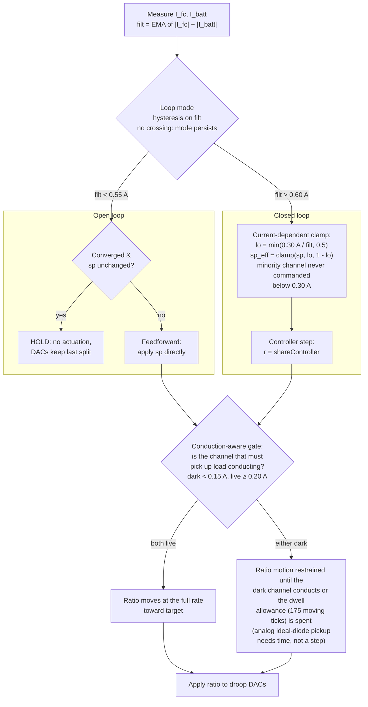
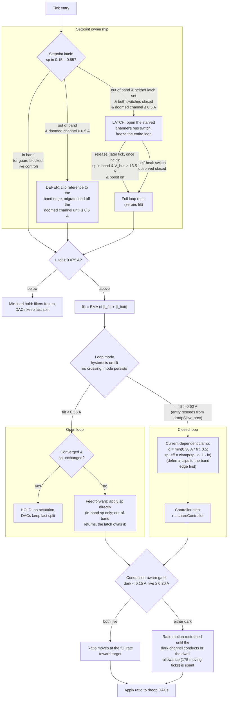
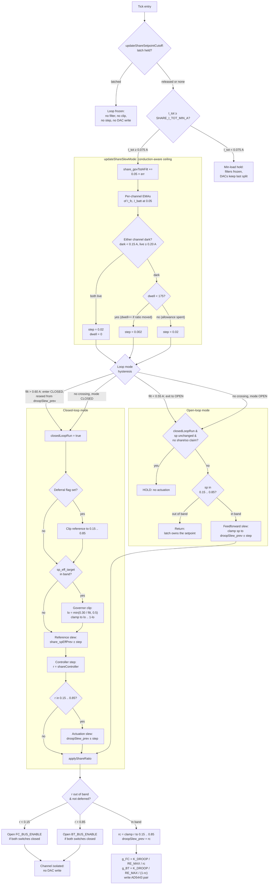
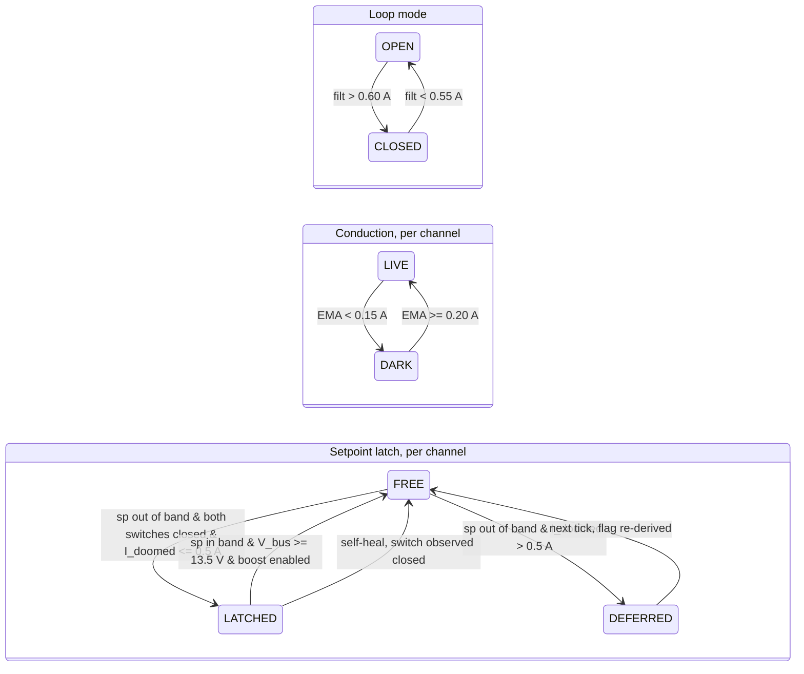

# The Power-Share Governor

## 1. Scope

This document specifies the **share-loop governor**: the supervisory logic in
`teensy_controller/teensy_controller.ino` that decides what reference the power-share
controller sees, whether that controller runs at all, and how fast the resulting split may
move. The document is written for an independent simulation of the governor alongside an
external energy-management system (EMS).

The internals of the share controller itself are outside the scope of this document. The
controller is treated here as a black box with the interface

```
r = shareController(sp_eff, share_meas)      r ∈ [0, 1]
```

which is stepped once per `SHARE_CTRL_TS_US` = 1000 µs and holds its output between steps.
The motor loop, the encoder, the charger and the fault system are also outside the scope,
except where the governor reads a bus-voltage threshold.

**Definitions.** The **share ratio** `r` is the commanded fraction of total source current
carried by the fuel-cell (FC) channel; the battery (BT) channel carries `1 − r`. The
**setpoint** `sp` is the EMS-commanded share ratio, held in `power_share_setpoint`. The
**measured share** is `|I_fc| / (|I_fc| + |I_batt|)`. The **total current** is
`I_tot = |I_fc| + |I_batt|`.

**Tick rate.** `powerBalance()` is rate-limited to `POWER_BAL_PERIOD_US` = 1000 µs, so 1 kHz
is a ceiling, not a guarantee. The measured main-loop rate on hardware is approximately
880 Hz, and the share tick therefore degenerates to the loop rate. Every per-tick constant in
this document is an increment per executed share tick. Wall-clock durations quoted below use
the measured 880 Hz figure.

## 2. Constants

| Name | Value | Units | Meaning |
|---|---|---|---|
| `POWER_BAL_PERIOD_US` | 1000 | µs | Minimum share-tick period (measured tick ≈ 1136 µs) |
| `SHARE_CTRL_TS_US` | 1000 | µs | Controller update cadence; output held between updates |
| `SHARE_I_TOT_MIN_A` | 0.075 | A | Minimum-load gate; below this the whole loop freezes |
| `SHARE_GOV_FILT_ALPHA` | 0.05 | — | EMA weight per tick (≈ 20 ms) for all governor filters |
| `SHARE_MINORITY_I_MIN_A` | 0.30 | A | Minority-channel conduction floor enforced by the clip |
| `SHARE_GOV_OL_HYST_A` | 0.05 | A | Hysteresis on the closed→open loop-mode exit |
| `DROOP_R_MIN` | 0.15 | — | Lower edge of the physical droop band |
| `DROOP_R_MAX` | 0.85 | — | Upper edge of the physical droop band |
| `DROOP_RATIO_SLEW_PER_TICK` | 0.02 | ratio/tick | Normal ceiling on ratio motion |
| `DROOP_RATIO_SLEW_HANDOFF_PER_TICK` | 0.002 | ratio/tick | Ceiling while a channel is dark |
| `SHARE_HANDOFF_MIN_A` | 0.15 | A | Filtered per-channel current below which a channel is dark |
| `SHARE_HANDOFF_LIVE_A` | 0.20 | A | Filtered per-channel current at which a channel returns live |
| `SHARE_HANDOFF_DWELL_MAX_TICKS` | 175 | ticks | Motion-gated slow-walk allowance per dark event (≈ 200 ms) |
| `SHARE_CUT_MAX_HANDOFF_A` | 0.5 | A | Doomed-channel current ceiling above which a cut is deferred |
| `SHARE_CUTOFF_HYST` | 0.01 | — | Re-entry hysteresis of the r-based backstop cutoff |
| `SHARE_SP_CHANGE_EPS` | 1e-4 | — | Deadband for "the setpoint changed" |
| `V_BUS_CHARGED_THRESH` | 13.5 | V | `V_BUS_NOMINAL − 2.5`; bus considered regulated |
| `K_DROOP` | 0.30 | Ω | Design droop scale (`TODO(calibrate)` in firmware) |
| `RE_MAX` | 2.014 | Ω | Maximum electronic droop resistance per channel |
| `MDAC_res` | 4095 | counts | AD5443 multiplying DAC (MDAC) 12-bit full scale |

### Initial state

Every stateful governor variable, with its value at boot. The reset column gives the value
written by `resetShareControlState()`, the full share-loop reset invoked at a latch release
and at profile start.

| Variable | Boot | Reset | Meaning |
|---|---|---|---|
| `share_govTotAFilt` | 0.0 | 0.0 | Filtered total current |
| `droopSlew_prev` | 0.5 | *not reset* | Ratio last applied to the MDACs |
| `shareClosedLoopMode` | false | false | Closed loop active |
| `shareClosedLoopRun` | false | false | Closed loop has run since the last reset |
| `share_actedSp` | 0.5 | `power_share_setpoint` | Setpoint last acted upon |
| `share_spEffPrev` | 0.5 | 0.5 | Slew-limited controller reference |
| `shareSpCutFC` / `shareSpCutBT` | false | *not reset* | Setpoint latches |
| `shareIsoFC` / `shareIsoBT` | false | *not reset* | Ratio-based topology claims |
| `shareCutDeferredFC` / `shareCutDeferredBT` | false | false | Deferral flags, re-derived each tick |
| `shareHandoffIFcFilt` / `shareHandoffIBtFilt` | 0.0 | 0.0 | Per-channel filtered magnitudes |
| `shareHandoffDarkFC` / `shareHandoffDarkBT` | **true** | true | Conduction state, dark at boot |
| `shareHandoffDwell` | 0 | 0 | Slow ticks spent this dark event |
| `shareHandoffPrevRatio` | 0.5 | `droopSlew_prev` | Motion detector, previous `droopSlew_prev` |
| `shareSlewStepThisTick` | 0.002 | 0.002 | The tick's slew ceiling |

The dark flags start **true**, so the first ticks after boot run at the reduced slew ceiling
until both filtered magnitudes reach `SHARE_HANDOFF_LIVE_A`.

## 3. Setpoint governor clip

The governor clips the effective setpoint so that the commanded minority current stays at or
above `SHARE_MINORITY_I_MIN_A`. The clip operates on the **filtered** total current
`share_govTotAFilt`, an exponential moving average of `I_tot` at `SHARE_GOV_FILT_ALPHA` per
tick. Filtering prevents converter noise from dithering the bounds.

```
lo = SHARE_MINORITY_I_MIN_A / share_govTotAFilt
if (lo > 0.5) lo = 0.5
hi = 1.0 - lo
sp_eff_target = clamp(sp, lo, hi)
```

The clamp of `lo` at 0.5 covers the hysteresis sliver below `2·SHARE_MINORITY_I_MIN_A`, where the
raw bound inverts (`lo > hi`) and a naive clamp would command the minority split on the wrong
channel. The clip is applied **only** to in-band setpoints; an out-of-band setpoint is owned
by the latched channel cutoff of Section 6 and never reaches this code.

## 4. Loop mode: open loop, closed loop

The loop-mode decision is hysteretic on the same filtered total current.

- **Entry to closed loop:** `share_govTotAFilt > 2·SHARE_MINORITY_I_MIN_A` = 0.60 A.
- **Exit to open loop:** `share_govTotAFilt < 2·SHARE_MINORITY_I_MIN_A − SHARE_GOV_OL_HYST_A`
  = 0.55 A.

Below the entry threshold the controller is **not stepped at all**. A closed loop cannot hold
a split for which it has neither the droop authority nor the channel conduction. Commanding
one below that threshold produces source commutation and bus collapse.

Open-loop mode has two behaviours, selected by `shareClosedLoopRun`, the flag recording
whether the closed loop has run since the last controller reset.

1. **Feedforward** (`shareClosedLoopRun` false): the **raw** setpoint is fed forward through
   the slew limiter of Section 5. The governor clip is not applied on this path.
2. **Hold** (`shareClosedLoopRun` true): no actuation at all. The multiplying DACs keep the
   split the closed loop converged to before the load fell away. The hold condition is
   `|sp − share_actedSp| <= SHARE_SP_CHANGE_EPS` **and** `!(shareIsoFC || shareIsoBT)`, where
   `share_actedSp` records the setpoint the loop last acted upon. Failing either term falls
   through to feedforward. An outstanding `shareIsoFC` or `shareIsoBT` claim does so because
   its re-entry path lives in the actuation function, which a hold never calls. A changed
   setpoint does so because a command must take effect at once; that case also clears
   `shareClosedLoopRun`, which re-arms feedforward.

An out-of-band setpoint is never actuated on the feedforward path; the tick returns quietly
and the latch of Section 6 claims it on the next tick.

The open→closed transition reseeds the controller from `droopSlew_prev`, the ratio physically
applied to the MDACs, rather than from the balanced default. The reseed writes the controller
integrator, not merely its held output, and does **not** clear `share_govTotAFilt`.

## 5. Handover continuity and the conduction-aware slew ceiling

Three slew sites share one ceiling value, `shareSlewStepThisTick`, computed once per tick by
`updateShareSlewMode()` and read by every site. The sites are the open-loop feedforward clamp
of Section 4, the reference slew, and the actuation slew. Reference and actuation therefore
cannot disagree about how fast the split may move.

**Feedforward slew.** In open-loop feedforward the raw setpoint is clamped about
`droopSlew_prev` by the tick's ceiling before actuation.

**Reference slew.** `share_spEffPrev` walks toward the clipped target at the tick's ceiling:

```
share_spEffPrev = clamp(sp_eff_target,
                        share_spEffPrev - step,
                        share_spEffPrev + step)
sp_eff = share_spEffPrev
```

This removes the reference discontinuity that the open→closed handover otherwise produces,
because feedforward commands the raw setpoint while the first closed-loop tick would command
the clipped one.

**Actuation slew.** The controller output `r` is limited about `droopSlew_prev` by the same
step, but **only** while `r` lies inside `[DROOP_R_MIN, DROOP_R_MAX]`. An out-of-band command
passes through unlimited, so the cutoff logic sees the controller's true intent.

**Conduction-aware ceiling.** Each channel carries its own EMA of `|I_fc|` and `|I_batt|` at
`SHARE_GOV_FILT_ALPHA`. A channel becomes **dark** when its filtered magnitude falls below
`SHARE_HANDOFF_MIN_A` = 0.15 A, and returns **live** only at or above `SHARE_HANDOFF_LIVE_A`
= 0.20 A. The ceiling is then selected as follows.

| Condition | Ceiling | Dwell counter |
|---|---|---|
| Both channels live | `DROOP_RATIO_SLEW_PER_TICK` (0.02) | reset to 0 |
| Either dark, dwell < 175 | `DROOP_RATIO_SLEW_HANDOFF_PER_TICK` (0.002) | incremented **only if the applied ratio moved** on the previous tick |
| Either dark, dwell ≥ 175 | `DROOP_RATIO_SLEW_PER_TICK` (0.02) | held |

Motion is detected as a change in `droopSlew_prev` greater than 1e-6 between consecutive
ticks. The allowance is therefore spent by walking, not by waiting, and it re-arms only when
both channels return live. The bound is one allowance of at most 175 moving ticks (≈ 200 ms
at 880 Hz) per dark event, after which the full rate resumes for the remainder of that event.

## 6. Setpoint-latched channel cutoff

The principle is **one owner per setpoint**. A setpoint outside `[DROOP_R_MIN, DROOP_R_MAX]`
is not a droop command but an instruction to take the starved channel off the bus.

**Entry.** With `sp < DROOP_R_MIN` the FC bus switch is opened and `shareSpCutFC` latches;
with `sp > DROOP_R_MAX` the BT bus switch is opened and `shareSpCutBT` latches. Entry
requires three conditions: neither latch already set; **both** bus switches presently closed
(the loop must never darken the bus, and must never claim a switch another agent opened); and
the doomed channel's measured current at or below `SHARE_CUT_MAX_HANDOFF_A` = 0.5 A, because
the cut transfers that whole current onto the survivor in one tick.

**Deferral.** When only the current ceiling blocks the cut, the tick sets the per-tick
deferral flag `shareCutDeferredFC` or `shareCutDeferredBT` instead of latching. The deferral
clips the controller reference onto the doomed side's band edge. That clip migrates load off
the doomed channel until its current falls under the ceiling and the cut can fire. The
deferral also suppresses the r-based backstop on that side, which has no current guard of its
own.

**While latched.** The entire share loop is frozen: no filter update, no governor clip, no
controller step, no MDAC write. Freezing prevents the topology-forced share error from winding
the controller back across the re-entry hysteresis.

**Release.** The latch releases when the setpoint returns in band, `V_bus ≥
V_BUS_CHARGED_THRESH`, and the corresponding boost regulator is enabled. Release re-closes the
bus switch, clears the latch, and fully resets the controller state. That reset zeroes
`share_govTotAFilt`, so approximately 20–40 ms of open-loop feedforward follow while the
filter re-climbs past `2·SHARE_MINORITY_I_MIN_A`. A release tick returns control to the loop
for at least one tick before the opposite latch may engage.

**Self-heal.** A latch is a claim of ownership over an open switch. If the switch reads closed
again, the claim is orphaned and is dropped, so a stale latch degrades to live control rather
than to a frozen loop. The same tick also drops an orphaned `shareIsoFC` or `shareIsoBT` claim
that has no setpoint latch behind it, because that claim otherwise suppresses every subsequent
DAC write.

**In-band backstop.** The ratio-based cutoff in `applyShareRatio()` remains. It fires on the
controller output `r` rather than on the setpoint, and covers an in-band setpoint whose
controller output leaves the band. Re-entry of the FC channel requires all four of
`!shareSpCutFC`, `r ≥ DROOP_R_MIN + SHARE_CUTOFF_HYST`, `V_bus ≥ V_BUS_CHARGED_THRESH`, and
`FC_REG_ENABLE` high. The BT channel mirrors this with `r ≤ DROOP_R_MAX − SHARE_CUTOFF_HYST`
and `BT_REG_ENABLE`.

## 7. Actuation: from ratio to hardware

`applyShareRatio(r)` clamps `r` to `[0, 1]`, evaluates the cutoff and re-entry logic above,
then clips the surviving ratio to `rc ∈ [DROOP_R_MIN, DROOP_R_MAX]`, records `rc` in
`droopSlew_prev`, and maps it to the two gains

```
g_FC = K_DROOP / (RE_MAX · rc)
g_BT = K_DROOP / (RE_MAX · (1 - rc))
code = (uint16) (clamp(g, 0.0, 1.0) * MDAC_res)      # C truncation toward zero
```

Each code is written as a 12-bit word to the AD5443 pair over SPI. The quantization is
truncation, not rounding, and the resolution is one part in `MDAC_res` = 4095. The gains set
each boost regulator's electronic droop resistance in hardware, which is what physically
apportions the current. No DAC write occurs while a channel is isolated.

## 8. Per-tick algorithm

```
powerBalance():                       # rate-limited to POWER_BAL_PERIOD_US (1 kHz max);
                                      # measured main-loop rate ~880 Hz is the actual cadence
    if updateShareSetpointCutoff():   # self-heal, release, entry/deferral
        return                        # LATCHED: entire loop frozen

    I_tot = |I_fc| + |I_batt|
    if I_tot < SHARE_I_TOT_MIN_A: return          # min-load hold, no filter update

    share_govTotAFilt += ALPHA * (I_tot - share_govTotAFilt)

    updateShareSlewMode():                        # per-channel EMAs, dark/live
        step = DROOP_RATIO_SLEW_PER_TICK          if both live (dwell = 0)
             = DROOP_RATIO_SLEW_HANDOFF_PER_TICK  if either dark, dwell < 175
                                                  (dwell++ only if ratio moved)
             = DROOP_RATIO_SLEW_PER_TICK          if either dark, dwell >= 175

    # loop-mode hysteresis
    if not closedLoop and share_govTotAFilt > 2*SHARE_MINORITY_I_MIN_A:
        closedLoop = True; reseed controller from droopSlew_prev
    elif closedLoop and share_govTotAFilt < 2*SHARE_MINORITY_I_MIN_A - SHARE_GOV_OL_HYST_A:
        closedLoop = False

    if not closedLoop:
        spChanged = |sp - share_actedSp| > SHARE_SP_CHANGE_EPS
        if closedLoopRun and not spChanged and not (shareIsoFC or shareIsoBT):
            return                                # HOLD, no actuation
        if spChanged: closedLoopRun = False
        if sp outside [DROOP_R_MIN, DROOP_R_MAX]: return      # latch owns it
        applyShareRatio(clamp(sp, droopSlew_prev ± step))     # feedforward slew
        share_actedSp = sp; return

    closedLoopRun = True; share_actedSp = sp
    sp_eff_target = sp
    if shareCutDeferredFC or shareCutDeferredBT:
        sp_eff_target = clamp(sp_eff_target, DROOP_R_MIN, DROOP_R_MAX)
    if DROOP_R_MIN <= sp_eff_target <= DROOP_R_MAX:           # governor clip
        lo = min(SHARE_MINORITY_I_MIN_A / share_govTotAFilt, 0.5)
        sp_eff_target = clamp(sp_eff_target, lo, 1 - lo)
    share_spEffPrev = clamp(sp_eff_target, share_spEffPrev ± step)   # reference slew
    sp_eff = share_spEffPrev
    r = shareController(sp_eff, |I_fc|/I_tot)
    if DROOP_R_MIN <= r <= DROOP_R_MAX:
        r = clamp(r, droopSlew_prev ± step)       # actuation slew
    applyShareRatio(r)                            # cutoff / band clip / DAC write
```

## 9. Simplified overview diagram

Figure 0 shows the three governing mechanisms in isolation: the loop-mode handoff on
filtered total current, the current-dependent setpoint clamp, and the conduction-aware
handoff gate (the qualitative form of the Section 5 slew ceiling). The setpoint latch, the
deferral path, the minimum-load gate, the numeric slew rates and the reference-slew site are
omitted here; Section 10 adds the ownership logic and Section 11 shows the complete tick.
When `filt` crosses neither loop-mode threshold, the existing mode persists (hysteresis); in
the firmware the conduction test runs once per tick, before the mode decision. In every
diagram label, `&` joins conditions that must all hold (AND) and "or" marks alternatives
(OR).



The three mechanisms answer three distinct questions. The loop-mode handoff asks whether
there is enough total current for closed-loop control to hold any split at all. The clamp
asks whether the commanded split would starve the minority channel below its conduction
floor. The conduction-aware handoff gate asks whether the channel being handed load is
physically conducting yet, and restrains ratio motion until it is.

## 10. Medium-detail flow diagram

Figure 0b adds the ownership logic to Figure 0: the setpoint latch, its deferral path, and
the minimum-load gate. The numeric slew rates are still omitted; Section 11 shows the
complete tick, and Figure 2 gives the multi-tick state machine that the ownership subgraph
summarizes.



While the latch holds, no other mechanism runs: the loop is frozen until release. The
deferral is the transition into the latch, not a separate steady state; it is re-derived
every tick and disappears either when the cut fires or when the setpoint returns in band.
When the last-source guard blocks both the latch and the deferral, the tick falls through
to normal governed control.

## 11. Flow diagram

Figure 1 shows the decision flow of one governor tick. Every edge label carries the threshold
that selects it, and every branch corresponds to a line of the Section 8 pseudocode.



The three hysteretic state machines the tick depends upon are shown separately in Figure 2.



## 12. Interface to the energy-management system

The EMS commands `power_share_setpoint` in the 22-byte command packet. The governor may
override that setpoint by clipping it, by refusing to act on it in hold mode, or by latching a
channel off the bus. The command packet carries no acknowledgement field. The applied ratio is
observable through telemetry instead.

Telemetry, protocol version 4, 58 bytes, reports the applied state rather than the command.
The share-relevant fields are the measured share `power_share_actual` (float, offset 43) and
the two applied droop gains `droop_gain_FC_actual` and `droop_gain_BT_actual` (uint16, full
scale 65535, offsets 47 and 49). The `switch_state` bitmask sits at offset 52. Its bits
`SW_FC_BUS` = 0x01 and `SW_BT_BUS` = 0x02 report the two bus switches and therefore expose an
active channel cutoff. The effective setpoint, the loop mode, the dark/live state and the
dwell counter are **not** telemetered. They are visible only on the State-98 serial status
dump.

## 13. MATLAB and Simulink implementation

### 13.1 Architecture

The governor is one sequential per-tick algorithm over cross-coupled persistent state. Model
it as a **single discrete-time MATLAB Function block**, or as a plain MATLAB function with a
persistent state struct. Do not decompose it into Simulink logic blocks: the latch, the
deferral flag, the loop mode and the slew ceiling are read and written in a fixed order within
one tick, and a block diagram makes that order implicit and fragile.

Use a fixed sample time of **1 ms**, matching `POWER_BAL_PERIOD_US`. To match hardware more
closely, use **1.136 ms**, the measured tick period at 880 Hz. All governor constants are
**per tick**, not per second, so the wall-clock behaviour shifts with the chosen step. The
slew rates and the dwell allowance are the sensitive ones: `DROOP_RATIO_SLEW_PER_TICK` is
0.02 per tick, which is 20 ratio units per second at 1 ms and 17.6 at 1.136 ms.

### 13.2 Reference skeleton

```matlab
function [st, out] = governor_tick(st, in)
% in:  sp, I_fc, I_batt, V_bus, fcBusClosed, btBusClosed, fcRegEn, btRegEn
% st:  persistent governor state (fields mirror the Initial-state table, §2)
% out: r_applied, g_FC, g_BT, code_FC, code_BT, mode, latch, dark, dwell

  C = governor_constants();          % the §2 table, one struct

  % 1. Setpoint latch ownership (self-heal, release, entry/deferral).
  [st, frozen] = update_setpoint_cutoff(st, in, C);
  if frozen, out = emit(st, C); return; end

  I_tot = abs(in.I_fc) + abs(in.I_batt);
  if I_tot < C.SHARE_I_TOT_MIN_A, out = emit(st, C); return; end
  st.govTotAFilt = st.govTotAFilt + C.ALPHA*(I_tot - st.govTotAFilt);

  % 2. Conduction-aware slew ceiling (one value for the whole tick).
  moved = abs(st.droopSlewPrev - st.handoffPrevRatio) > 1e-6;
  st.handoffPrevRatio = st.droopSlewPrev;
  st.iFcFilt = st.iFcFilt + C.ALPHA*(abs(in.I_fc)   - st.iFcFilt);
  st.iBtFilt = st.iBtFilt + C.ALPHA*(abs(in.I_batt) - st.iBtFilt);
  st.darkFC  = hyst(st.darkFC, st.iFcFilt, C.HANDOFF_MIN_A, C.HANDOFF_LIVE_A);
  st.darkBT  = hyst(st.darkBT, st.iBtFilt, C.HANDOFF_MIN_A, C.HANDOFF_LIVE_A);
  if ~(st.darkFC || st.darkBT)
      st.dwell = 0;  st.step = C.SLEW_PER_TICK;
  elseif st.dwell >= C.DWELL_MAX_TICKS
      st.step = C.SLEW_PER_TICK;
  else
      if moved, st.dwell = st.dwell + 1; end
      st.step = C.SLEW_HANDOFF_PER_TICK;
  end

  % 3. Loop-mode hysteresis, 4. open loop, 5. closed loop — see §8 pseudocode.
  %    The closed-loop branch calls a controller stub:
  %       r = share_controller(st, sp_eff, abs(in.I_fc)/I_tot);
  %    Substitute a PI law, or the shipped Youla coefficients, later.
  ...
  st = apply_share_ratio(st, r, in, C);   % cutoff, band clip, gain map
  out = emit(st, C);
end
```

The state struct must carry exactly the fields of the Initial-state table in Section 2:
`govTotAFilt`, `droopSlewPrev`, `closedLoopMode`, `closedLoopRun`, `actedSp`, `spEffPrev`,
`spCutFC`, `spCutBT`, `isoFC`, `isoBT`, `cutDeferredFC`, `cutDeferredBT`, `iFcFilt`,
`iBtFilt`, `darkFC`, `darkBT`, `dwell`, `handoffPrevRatio`, `step`. Initialize them to the
boot column of that table; note that `darkFC` and `darkBT` start **true**.

### 13.3 Interface

**Inputs.** The commanded setpoint `sp`; the two channel currents `I_fc` and `I_batt`; the bus
voltage `V_bus`; the two bus-switch states; and the two boost-enable states. A simulation that
does not model the switches may assume both bus switches closed and both boosts enabled, at
the cost of losing the release guards and the self-heal path.

**Outputs.** The applied ratio `r` (equal to `droopSlewPrev` after the tick); the two gains
`g_FC` and `g_BT`; the two DAC codes; the loop mode; the latch and deferral flags; the
dark/live flags; and the dwell counter. The gains close the loop back into the plant model,
and the flags exist for logging and comparison against hardware.

### 13.4 Fidelity notes

Single-precision against double precision is irrelevant for every governor threshold, because
each has a margin of at least 0.05 A or 0.01 ratio units. The one exception is the motion
gate `|droopSlew_prev − shareHandoffPrevRatio| > 1e-6`, which compares two quantities that
differ by one slew step or by nothing at all. Reproduce that comparison literally.

Reproduce the DAC truncation of Section 7 if the plant model is sensitive to droop resolution;
otherwise treat `g` as continuous and record the omission. The truncation biases every gain
low by up to one part in 4095.

Three orderings within the tick are load-bearing and must not be rearranged. The latch update
runs **before** the minimum-load gate, so that a release can occur at standstill. The slew
ceiling is computed **before** the open-loop branch, so that feedforward ticks also advance the
conduction filters and the dwell counter. The deferral flags are re-derived by the latch
update **every** tick, so the closed-loop reference clip reads this tick's value.

Validate against two hardware sources. The State-98 serial dump prints `share loop mode`,
`I_tot_filt`, `share slew mode`, the two filtered magnitudes, `dwell`, `step`, the
`share sp-cut latch`, and `droop gFC/gBT`, which together cover every internal governor state.
Telemetry, per Section 12, supplies `power_share_actual`, the two applied gains, and the bus
switch bits for a longer run.

## 14. Unconfirmed values

None. Every constant in Section 2 was read verbatim from
`teensy_controller/teensy_controller.ino` or `teensy_controller/share_controller_coeffs.h`.
Note that `K_DROOP` carries a `TODO(calibrate)` marker in the firmware itself: its value of
0.30 Ω is a design figure, not a bench-calibrated one, and it affects the MDAC gain mapping of
Section 7 only.
