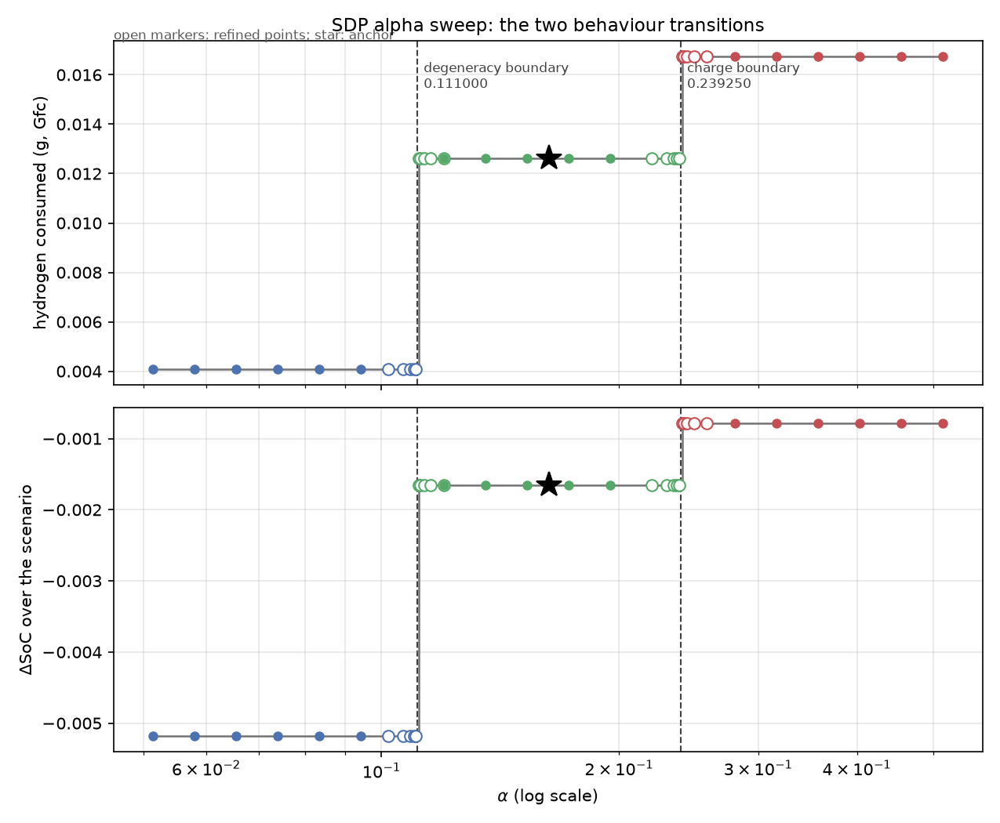
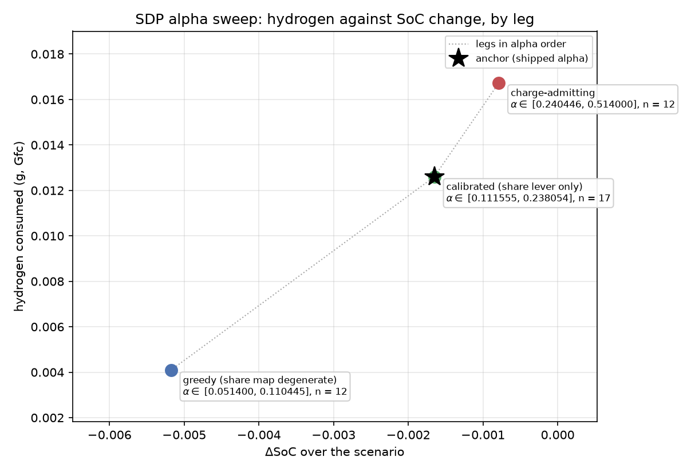
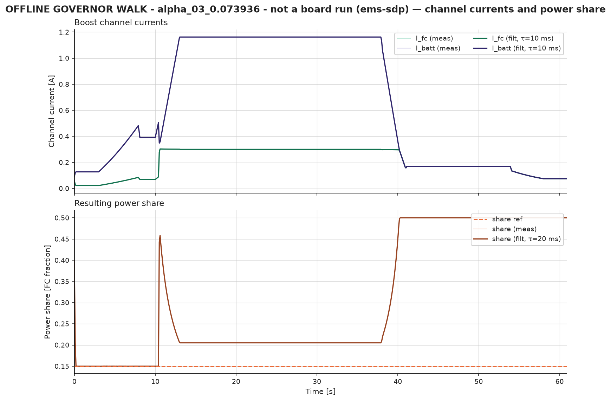
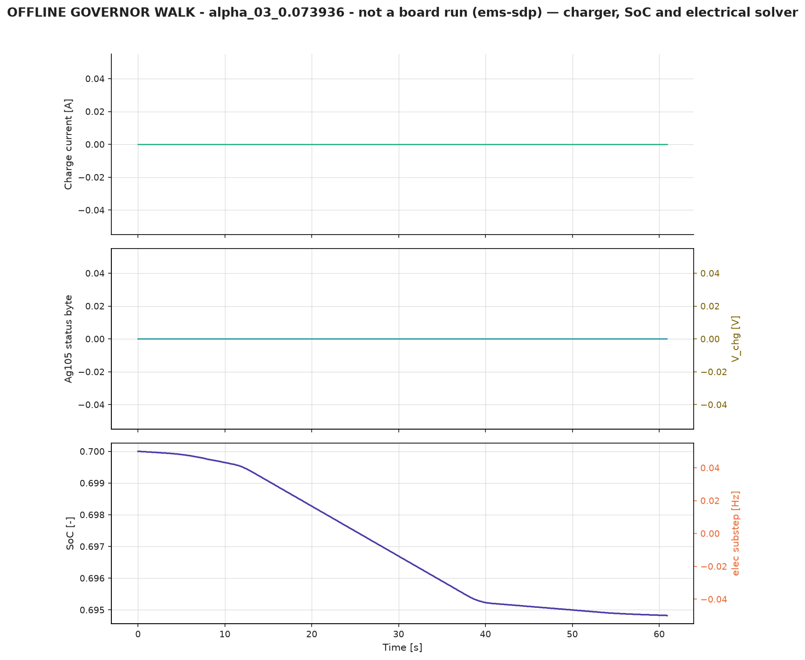
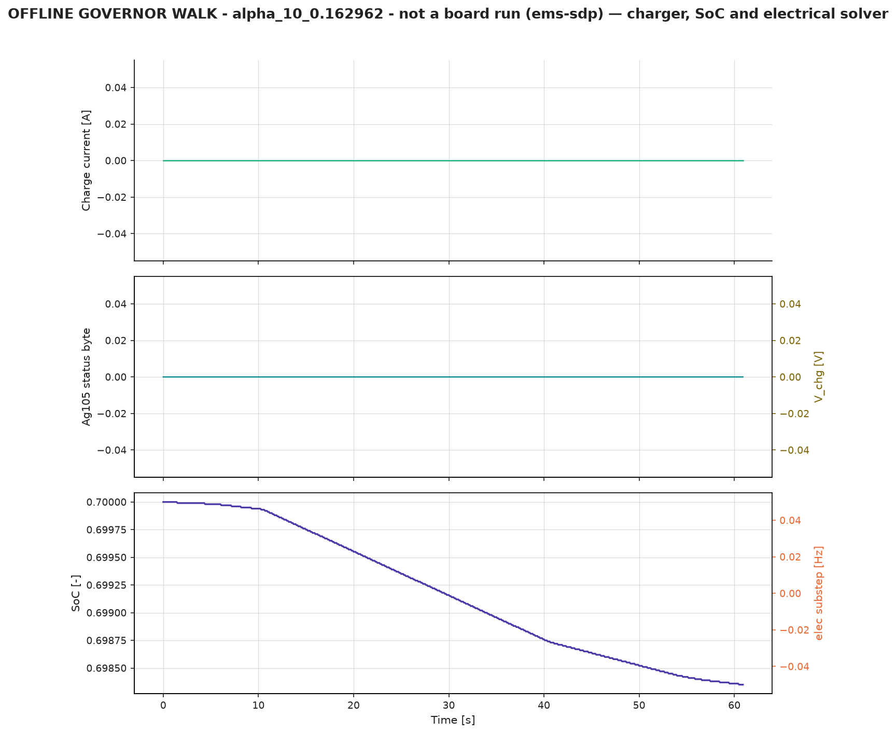
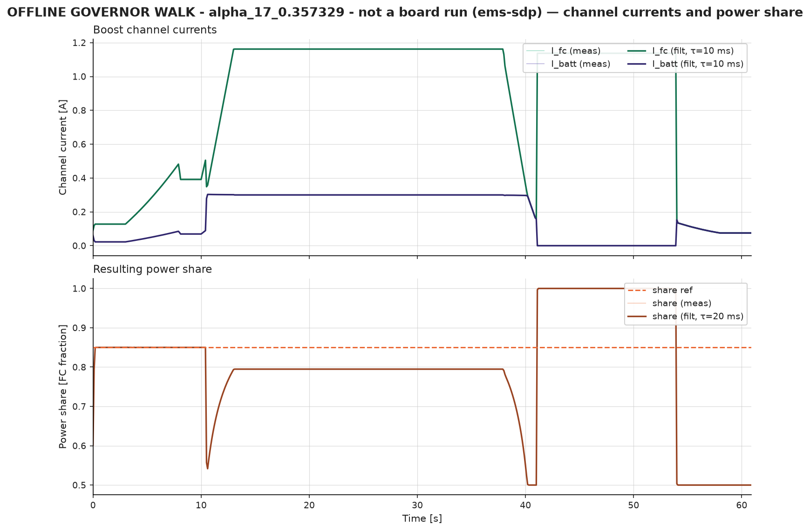
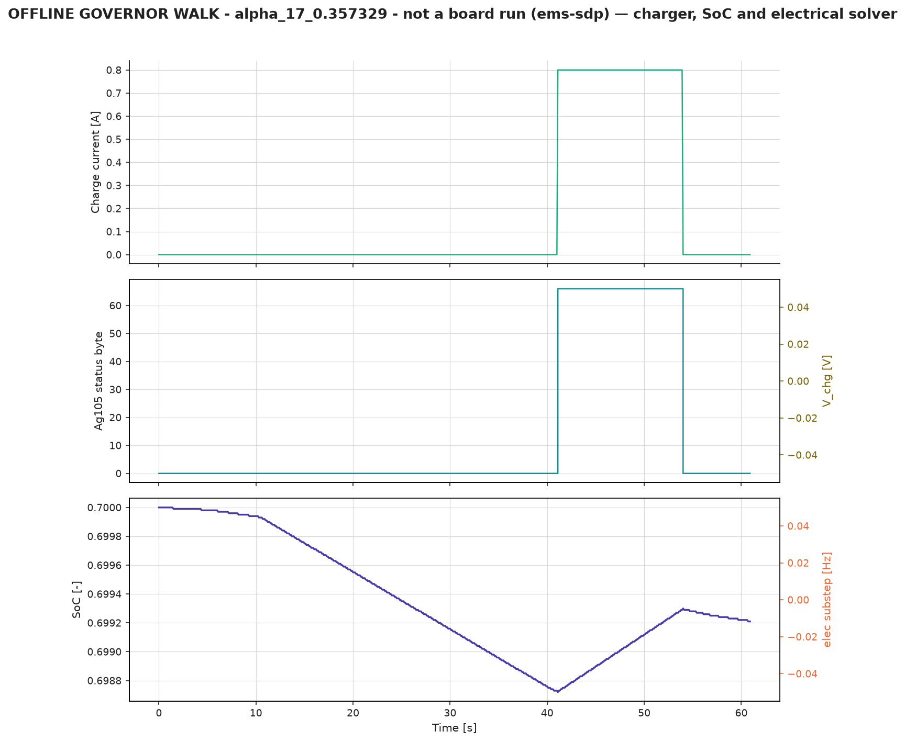
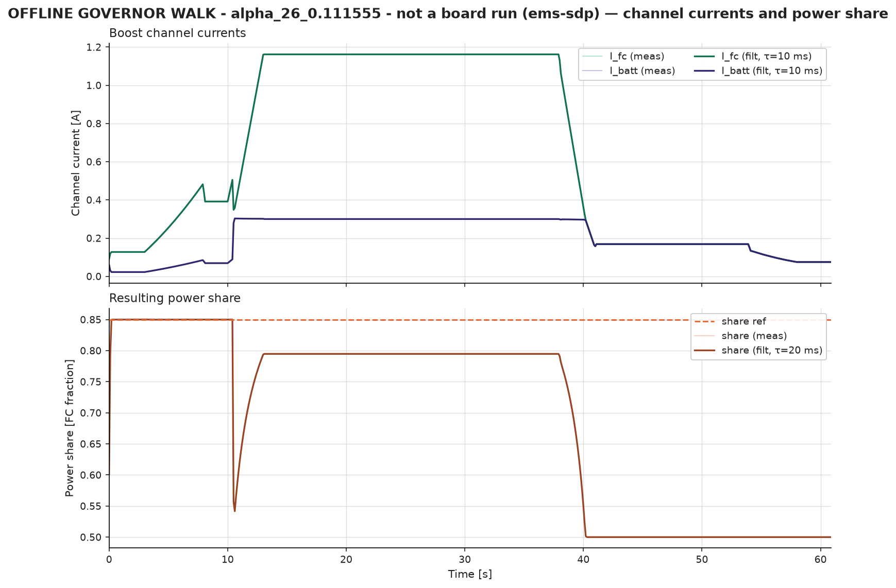

# SDP alpha sweep, 2026-09-01

## 1. Purpose

The stochastic-DP energy-management objective prices SoC deviation by the weight
`alpha`. The shipped artifact `tools/sdp_policies/sdp_policy_v3.json` carries one
value of that weight, set by two-sided lever calibration (decision D12). This
document records a 21-point sweep of `alpha` over the bench-scaled range of the
full-scale study, so the operator can choose three points for live runs and so
the charge-admission boundary is located by measurement rather than by argument.

The sweep artifacts are offline-evaluation artifacts. Section 5 states the
condition under which one may reach the board.

## 2. Range derivation

The full-scale study (`references/EMS/SDP_EnergyManagement2.m`) swept
`alpha` over [100, 1000]. Round B scaled the full-size weight onto this rig by
coulombic energy, which mapped 500 onto 0.2569444. The scale factor is therefore

    k = 0.2569444 / 500 = 5.138889e-4

and the bench-scaled range is

    [100, 1000] * k = [0.0514, 0.5139] ~= [0.0514, 0.514].

The grid takes 20 log-spaced points over [0.0514, 0.514] (`numpy.geomspace`,
endpoints inclusive). The shipped lever-calibrated weight,
`alpha = 0.1629624189805737`, is added as a flagged 21st anchor point. The anchor
is an addition, not a replacement: deleting it leaves the log-spaced grid intact.

## 3. The grid

Indices are assigned after an ascending sort, so the anchor takes index 10.
`in_model` and `in_measured` report whether the point lies strictly inside the
modelled admission window (0.111000, 0.239250) and the campaign-measured window
(0.121359, 0.211506), both read from the shipped artifact's own
`alpha.admission` block.

| idx | alpha | in_model | in_measured | anchor | charge cells | value-iteration sweeps |
|---:|---:|:--|:--|:--|---:|---:|
| 0 | 0.051400 | no | no | | 0 | 424 |
| 1 | 0.058022 | no | no | | 0 | 426 |
| 2 | 0.065498 | no | no | | 0 | 429 |
| 3 | 0.073936 | no | no | | 0 | 431 |
| 4 | 0.083462 | no | no | | 0 | 433 |
| 5 | 0.094215 | no | no | | 0 | 436 |
| 6 | 0.106354 | no | no | | 0 | 438 |
| 7 | 0.120056 | yes | no | | 0 | 440 |
| 8 | 0.135524 | yes | yes | | 0 | 443 |
| 9 | 0.152984 | yes | yes | | 0 | 445 |
| 10 | 0.162962 | yes | yes | ANCHOR | 0 | 446 |
| 11 | 0.172695 | yes | yes | | 0 | 448 |
| 12 | 0.194944 | yes | yes | | 0 | 450 |
| 13 | 0.220060 | yes | no | | 0 | 452 |
| 14 | 0.248413 | no | no | | 288 | 455 |
| 15 | 0.280418 | no | no | | 294 | 457 |
| 16 | 0.316546 | no | no | | 294 | 459 |
| 17 | 0.357329 | no | no | | 294 | 462 |
| 18 | 0.403367 | no | no | | 296 | 464 |
| 19 | 0.455336 | no | no | | 298 | 466 |
| 20 | 0.514000 | no | no | | 300 | 469 |

Every point converged (final sup-norm delta below the 1e-12 tolerance). Each
solve took approximately 0.2 s of wall time, so the whole sweep runs in about
five seconds.

## 4. Solver invocation

Each point is solved through `sdp_ems_solver.main(argv)` with

    --alpha <value> --demand-map 0.0 25.0 --out <artifact> [--allow-out-of-window]

An explicit `--alpha` overrides `--alpha-mode` entirely
(`tools/sdp_ems_solver.py:1092-1096`): the requested value is written to
`alpha.value` exactly, and `alpha.mode` records the string `"explicit"`. The
sweep therefore never passes `--alpha-mode`. The D12 admission tripwire refuses
a solve whose alpha lies outside either window, so `--allow-out-of-window` is
added for exactly the points marked "no" in Section 3. The demand map is the
consumer-owned rig-scale map [0, 25] W (decision D11), which is also the solver
default; it is passed explicitly so the artifact's `argv` records it.

## 5. Admission windows and live use

Twelve of the 21 points lie outside at least one admission window. Points 8-12
lie inside both. The consumer-side certificate
`sdp_assert_calibrated_benchmark()` (`tools/hil_plant_sim.py:4103`) requires
`alpha.mode == "lever"` in addition to both window flags, so **no sweep artifact
can be bound to the frontier-scored `sdp-v3` strategy** — including the anchor,
whose explicit alpha makes its mode `"explicit"` rather than `"lever"`. A sweep
point reaches the board only through the non-frontier `sdp-v2` role, which the
certificate's own refusal text names as the correct destination for an
uncertified artifact. A run so bound is a dynamics demonstration, and its
hydrogen and SoC pair must not be placed on the EMS frontier.

## 6. Artifact identity

Two digests are recorded per point, and they answer different questions.

- `policy_sha256` is the digest of the `policy` block alone, matching the
  consumer's identity rule (`load_sdp_policy`, `tools/hil_plant_sim.py:4063-4080`).
  It is the decision law, and it is invariant to `generated_utc`, `argv`, and the
  alpha provenance block.
- `file_sha256` is the digest of the whole file. It moves on every regeneration
  because `generated_utc` moves. Never pin it.

**Anchor verification: MATCH.** The anchor point's `policy_sha256` is
`0443febf240a9f5c207c42595f5841d2842496ac786c4d5342f1f8dfe33c61a2`, identical to
`sdp_policy_v3.json`'s. The explicit-alpha path therefore reproduces the shipped
decision law bit for bit against the same TPM, demand map, and grid arguments.

## 7. Where charging enters the policy

Charging is absent from the policy for every point up to and including
alpha = 0.220060, and present from alpha = 0.248413 upward. A geometric
bisection between those two points, run through the solver's `--dry-run` path,
locates the boundary at

    alpha_charge = 0.23925 (+/- 1e-5)

which is the upper end of the modelled admission window, (0.111000, 0.239250),
to five decimal places. The window arithmetic and the solved policy therefore
agree: charging is taken exactly when the shadow price `alpha/(1-gamma)` makes
the modelled Ag105 charge lever worth its hydrogen. Above the boundary the charge
cell count rises slowly with alpha, from 288 cells at 0.248413 to 300 cells at
0.514000, out of 2525 policy cells.

A second structural boundary sits at the other end of the grid. Points 0 to 6
(alpha <= 0.106354) command share 0.0 in **every** policy cell: the SoC term is
too weak to buy any fuel-cell bias, and the policy collapses to pure hydrogen
greed. Points 7 upward carry a non-degenerate share map. The sweep therefore
brackets both degeneracies, which is the property that makes it useful for
choosing live points.

## 8. Offline evaluation

Every point was walked offline through `tools/ems_walk.py` bound to `sdp-v2`
(Section 5), on two stimuli: `ems-sdp` (the 61 s comparison scenario) and
`ems-ftp75-sdp` (the 340 s drive cycle). Equivalent hydrogen prices the SoC
difference against the anchor at lambda = 0.41 SoC/g
(`tools/run_hil_suite.py:6497`).

These figures come from the corrected walk (post-fix-round `ems_walk.py`: the
`ems-sdp` drain profile and the state-gated governor with firmware-like bus
re-assertion). The anchor's `ems-sdp` hydrogen is 0.0126027 g, +0.48 % against
the campaign-measured 0.0125424 g. Any earlier figure from this sweep is
superseded.

### 8.1 Scenario `ems-sdp`

| points | alpha range | h2 (g) | dSoC | eq-H2 (g) | charge windows |
|:--|:--|---:|---:|---:|---:|
| 0-6 | 0.051400 - 0.106354 | 0.00409302 | -0.0051763 | 0.0126924 | 0 |
| 7-13 (incl. anchor) | 0.120056 - 0.220060 | 0.01260270 | -0.0016506 | 0.0126027 | 0 |
| 14-20 | 0.248413 - 0.514000 | 0.01673160 | -0.0007880 | 0.0146277 | 1 |

### 8.2 Scenario `ems-ftp75-sdp`, zero-preload era

`FTP75_SDP_PRELOAD_A` was set to 0.0 in commit 88e11f0. Every figure in this
subsection is from the **zero-preload era**; campaign 151156 was the last run
of the preloaded era. The two eras are not comparable, and a preloaded-era
figure must never be quoted against a zero-preload one.

The table below is the zero-preload result over all 41 points (Section 10 adds
indices 21-40), and it supersedes the preloaded-era table kept at 8.2.1.

| points | alpha range | h2 (g) | dSoC | eq-H2 (g) | charge windows |
|:--|:--|---:|---:|---:|---:|
| 0-6, 21-25 | 0.051400 - 0.110445 | 0.0162053 | -0.0162103 | 0.0193485 | 0 |
| 7-13, 26-35 | 0.111555 - 0.238054 | 0.0193470 | -0.0149216 | 0.0193470 | 0 |
| 14-20, 36-40 | 0.240446 - 0.514000 | 0.0196655 | -0.0148553 | 0.0195038 | 1 |

**Points 7-20 are no longer identical on FTP-75.** At zero preload the drive
cycle admits exactly one charge window for every charge-admitting artifact, so
the stimulus now resolves the charge boundary of Section 7 as well as the
degeneracy boundary. Both boundaries therefore fall in the same place on both
stimuli, which the preloaded era did not show: the preload had foreclosed the
charge window on the drive cycle.

The margins are much narrower here than on `ems-sdp`. The calibrated band leads
the degenerate leg by 0.08 % and the charge-admitting leg by 0.80 % in
equivalent hydrogen, against 0.71 % and 16.1 % on `ems-sdp`. Both FTP-75
margins are inside the lambda band (0.409, 0.415), so `ems-sdp` remains the
discriminating stimulus and the FTP-75 ordering is a weak result on its own.

#### 8.2.1 Preloaded era, historical

Retained for provenance only. Computed at `FTP75_SDP_PRELOAD_A = 0.45` over the
original 21 points, before commit 88e11f0. **Superseded; do not quote.**

| points | alpha range | h2 (g) | dSoC | eq-H2 (g) | charge windows |
|:--|:--|---:|---:|---:|---:|
| 0-6 | 0.051400 - 0.106354 | 0.0327379 | -0.0304816 | 0.0614450 | 0 |
| 7-20 (incl. anchor) | 0.120056 - 0.514000 | 0.0610959 | -0.0187117 | 0.0610959 | 0 |

### 8.3 Observations

1. **Charge windows now open, on both stimuli.** Every charge-admitting
   artifact (points 14-20) opens exactly one charge window on `ems-sdp`, and,
   in the zero-preload era, exactly one on the drive cycle as well. The
   preloaded-era statement that the drive cycle opened none is superseded by
   Section 8.2. The charge boundary of Section 7 is therefore
   observable in behaviour, not only in the table. It costs hydrogen: those
   points consume 32.8 % more hydrogen than the calibrated band and finish
   16.1 % worse in equivalent hydrogen, for 0.00086 SoC of extra charge. This
   reproduces the standing charge-economics finding on a new axis.
2. **The "points 7-20 indistinguishable" claim from the pre-fix walk does not
   survive on `ems-sdp`.** The grid now resolves into three legs there, split at
   both boundaries the solver predicted: the share degeneracy at
   alpha <= 0.106354 and the charge admission at alpha = 0.23925. It does not
   survive on `ems-ftp75-sdp` either, once the preload is removed: at
   `FTP75_SDP_PRELOAD_A = 0.0` points 14-20 separate from 7-13 by a charge
   window. Both stimuli now resolve both boundaries at the same alpha.
3. **The calibrated band wins on both stimuli, and the margin is no longer
   knife-edge on the low side.** On `ems-sdp` the anchor band leads the
   degenerate leg by 0.71 % and the charge-admitting leg by 16.1 % in equivalent
   hydrogen; on the zero-preload drive cycle it leads the degenerate leg by
   0.008 % and the charge-admitting leg by 0.81 %. The ordering is the same on
   both stimuli. Every margin except the 16.1 % charge-leg margin on `ems-sdp`
   is inside the lambda band (0.409, 0.415), so those comparisons remain weak
   results; the 16.1 % margin is not.
4. **For choosing three live points**, `ems-sdp` is the discriminating stimulus:
   one point from each leg (for example idx 3, the anchor at idx 10, and idx 17)
   produces three distinct runs, and the same three legs are distinguishable on
   the zero-preload drive cycle, though by margins two orders of magnitude
   smaller.

The figures `sdp_alpha_sweep_20260901/sweep_h2_vs_dsoc_<scenario>.png` plot
hydrogen against SoC change with alpha annotated; the tables above are
reproduced per scenario in `sweep_eval_<scenario>.md` and as CSV in
`sweep_eval_<scenario>.csv`.

## 9. Reproduction

    C:/Users/ricky/miniforge3/python.exe tools/sdp_alpha_sweep.py grid
    C:/Users/ricky/miniforge3/python.exe tools/sdp_alpha_sweep.py solve --force
    C:/Users/ricky/miniforge3/python.exe tools/sdp_alpha_sweep.py evaluate \
        --scenario ems-sdp --scenario ems-ftp75-sdp         --out docs/modeling/sdp_alpha_sweep_20260901/

`evaluate --self-test` exercises the evaluation path against a synthetic walk
result and writes a `selftest` table, for use when the walk module is
unavailable.

## 10. Refined sweep: the two transition boundaries resolved

### 10.1 Purpose and method

Sections 7 and 8 located two behaviour transitions to the width of the
log-spaced grid, which is 12.9 % in alpha. This section locates each transition
by bisection and then samples five alpha points on each side of it, so both
regimes are observed with five samples within 8 % of the transition. The 20 new
points take indices 21 to 40 in the same artifact directory. The original 21
artifacts were not regenerated; their digests are unchanged.

The `refine` subcommand of `tools/sdp_alpha_sweep.py` performs the whole
operation:

    C:/Users/ricky/miniforge3/python.exe tools/sdp_alpha_sweep.py refine

Each boundary is defined by a predicate that is false below it and true above
it. The degeneracy predicate is "at least one policy cell commands share > 0";
the charge predicate is "at least one policy cell selects `charge_goal` > 0".
The bisection is geometric on log(alpha), because the sweep grid is geometric.
Both bracket ends are solved and tested before the bisection starts, so a
bracket that does not straddle the boundary raises rather than returning a
wrong answer. The bisection stops when the interval width falls below 1e-6 of
its midpoint.

### 10.2 Bisection results

| boundary | bracket | boundary alpha | interval half-width | solves |
|:--|:--|---:|---:|---:|
| degeneracy | [0.106354, 0.120056] | 0.111000013 | 5.1e-08 | 19 |
| charge | [0.220060, 0.248413] | 0.239249990 | 1.1e-07 | 19 |

Both boundaries land on an end of the modelled admission window
(0.111000, 0.239250), to a relative error of 1.2e-7 or better.

**What this establishes is discretization fidelity, not a new boundary.** The
admission window is by construction ((1-gamma)/L_share, (1-gamma)/L_chg), and
value iteration takes a lever exactly when L > (1-gamma)/alpha, from the same
two lever constants. The analytic transition alphas are therefore the window
ends by definition, and the bisection re-measures the solver's own closed form.
What it adds is the demonstration that the SoC-grid discretization, the linear
interpolation of J, and the forbidden-bin mask do not displace that analytic
threshold: the solved policy switches within 1.2e-7 relative of where the
closed form says it must. The charge boundary also reproduces the Section 7
value 0.23925 with a bisection interval four orders of magnitude tighter.

### 10.3 Spacing rule and the twenty points

Each boundary `b` receives ten points at

    alpha = b * (1 -/+ d),   d in {0.005, 0.01, 0.02, 0.04, 0.08}

The deltas are geometric at a factor of two per step. The pair straddling a
boundary therefore differs by 1 % in alpha, and the outermost pair by 16 %.
Indices run ascending in alpha within each boundary group, degeneracy first.
Every refined point converged, and every one was solved with an explicit alpha
outside at least one admission window, so all 20 carry `--allow-out-of-window`
and none can bind the frontier-scored `sdp-v3` strategy. Section 5 applies to
them unchanged.

| idx | alpha | boundary | side | share map | charge cells |
|---:|---:|:--|:--|:--|---:|
| 21 | 0.102120 | degeneracy | below | degenerate | 0 |
| 22 | 0.106560 | degeneracy | below | degenerate | 0 |
| 23 | 0.108780 | degeneracy | below | degenerate | 0 |
| 24 | 0.109890 | degeneracy | below | degenerate | 0 |
| 25 | 0.110445 | degeneracy | below | degenerate | 0 |
| 26 | 0.111555 | degeneracy | above | non-degenerate | 0 |
| 27 | 0.112110 | degeneracy | above | non-degenerate | 0 |
| 28 | 0.113220 | degeneracy | above | non-degenerate | 0 |
| 29 | 0.115440 | degeneracy | above | non-degenerate | 0 |
| 30 | 0.119880 | degeneracy | above | non-degenerate | 0 |
| 31 | 0.220110 | charge | below | non-degenerate | 0 |
| 32 | 0.229680 | charge | below | non-degenerate | 0 |
| 33 | 0.234465 | charge | below | non-degenerate | 0 |
| 34 | 0.236857 | charge | below | non-degenerate | 0 |
| 35 | 0.238054 | charge | below | non-degenerate | 0 |
| 36 | 0.240446 | charge | above | non-degenerate | 288 |
| 37 | 0.241642 | charge | above | non-degenerate | 288 |
| 38 | 0.244035 | charge | above | non-degenerate | 288 |
| 39 | 0.248820 | charge | above | non-degenerate | 288 |
| 40 | 0.258390 | charge | above | non-degenerate | 294 |

Two cross-checks fall out of the table. The charge-cell count enters at 288,
which is the count the first sweep recorded at idx 14, so the count steps at
the boundary rather than ramping through it. Point 40 carries the policy digest
`740c802e99dde3f53fad74d1844481f1030f11345a7ba8c9269014bbe2280087`, which is
`sdp_policy_v2.json`'s policy block: the refinement independently reproduces the
frozen v2 decision law from an alpha 8 % above the charge boundary.

### 10.4 Offline evaluation on `ems-sdp`

Every one of the 41 points was walked through `tools/ems_walk.py` bound to
`sdp-v2`. The combined table carries an `origin` column and is written to
`sdp_alpha_sweep_20260901/sweep_eval_all_ems-sdp.csv` and to the matching
`.md`. Equivalent hydrogen is priced against the anchor's SoC change at
lambda = 0.41 SoC/g.

| points | alpha range | h2 (g) | dSoC | eq-H2 (g) | charge windows |
|:--|:--|---:|---:|---:|---:|
| 0-6, 21-25 | 0.051400 - 0.110445 | 0.00409302 | -0.0051764 | 0.01269242 | 0 |
| 7-13, 26-35 | 0.111555 - 0.238054 | 0.01260274 | -0.0016506 | 0.01260274 | 0 |
| 14-20, 36-40 | 0.240446 - 0.514000 | 0.01673165 | -0.0007880 | 0.01462773 | 1 |

Three properties of that table are worth stating explicitly.

1. **Every refined point falls in the leg its side predicts, and no point
   changed behaviour where it was not expected to.** The walk results within a
   leg agree to every printed digit, but the POLICIES within a leg are not
   identical: idx 26 and idx 30 differ in 130 of 2525 cells, and idx 26 and
   idx 27 in 30 cells, and the hardware-envelope clamp does not erase those
   differences. The hydrogen totals coincide because this stimulus's trajectory
   never visits a differing cell. A live run would not discriminate within a
   leg either, except through noise-driven wandering onto a differing cell, so
   a within-leg pair is not a useful choice of live points. The commanded share
   is a single constant per point,
   0.150000 below the degeneracy boundary and 0.850000 above it, which are the
   two rails of the strategy's hardware-envelope clamp. The charge window is
   41.1 s to 53.9 s for every charge-admitting point.
2. **The transitions are sharp to 1 % in alpha.** Points 25 and 26 differ by
   1.00 % in alpha and by 208 % in hydrogen; points 35 and 36 differ by 1.00 %
   in alpha and by 32.8 % in hydrogen. There is no intermediate regime at this
   resolution.
3. **Governor mode residency does not depend on alpha.** All 41 walks report
   the same mode fractions, which are 48.99 % closed, 17.22 % open-feedforward
   and 33.79 % open-hold. The residency is therefore a property of the stimulus
   and the governor, not of the policy under test.

### 10.5 The drive cycle

The combined `ems-ftp75-sdp` table was regenerated over all 41 points in the
**zero-preload era** and is reported in Section 8.2, which it supersedes. It
shows the same three-leg structure as `ems-sdp`, with both boundaries at the
same alpha, including a charge leg that the preloaded era did not resolve on
that stimulus.

The era, not the sweep, is what moved the drive-cycle figures: the anchor's
`ems-ftp75-sdp` hydrogen is 0.0193470 g here against 0.0610959 g in
Section 8.2.1, because `FTP75_SDP_PRELOAD_A` went from 0.45 to 0.0 in commit
88e11f0. Campaign 151156 was the last preloaded run. **Never quote a
preloaded-era drive-cycle figure against a zero-preload one.** The `ems-sdp`
figures are unaffected by the preload change: the anchor there reproduces
Section 8.1's 0.0126027 g to six significant figures.

### 10.6 Figures

The figures below come from the **offline governor walk**, not from a board
run, and every suptitle says so. The synthesis path, the columns that are real,
and the reduced model's fidelity boundaries are documented in
`sdp_alpha_sweep_20260901/plots/README.md`. All 41 points are rendered for
`ems-sdp`; the 20 refined points are also rendered for `ems-ftp75-sdp`, under
the warning of Section 10.5.

#### The sweep as a whole

This is the view that shows the transitions. Both panels are flat across a leg
and step vertically at the two bisected boundaries, marked by the dashed lines;
the open markers are the refined points, dense on each side of each boundary,
and the star is the anchor.

The same 41 points in the hydrogen-against-SoC plane collapse onto three
positions, because every point in a leg is identical to eight decimals; each
leg is therefore drawn once and annotated with its alpha range and member
count, and the dotted line orders the legs by alpha rather than by index.

#### One representative point per leg

Point 3 (alpha 0.073936) sits in the degenerate leg. The commanded share holds
at the lower clamp rail 0.15, the fuel-cell channel is held near 0.30 A, and
the battery carries the remainder of the 1.16 A cruise load.

The charger never opens, the Ag105 status byte stays at 0x00, and SoC falls
monotonically to the leg's -0.00518.

The anchor point (alpha 0.162962) sits in the calibrated leg. The two channels
have exchanged roles against point 3: the commanded share is the upper rail
0.85, and the fuel cell carries the 1.16 A cruise load.

The charger still never opens. The SoC fall is a third of the degenerate leg's,
which is the whole return on the share lever.

Point 17 (alpha 0.357329) sits in the charge-admitting leg. The share command
is the same 0.85 rail, and the fuel-cell current steps up by the charger's
0.8 A between 41.1 s and 53.9 s while the battery channel is held off the bus.

The charge window is unmistakable. `I_charge` steps to the scenario's 0.8 A
ceiling, the status byte goes to 0x42, and the SoC trace reverses slope and
recovers 0.00043 before the window closes.

#### The degeneracy boundary, one point on each side

Point 25 (alpha 0.110445, 0.5 % below the boundary): the share command is the
lower rail 0.15 and the battery channel carries the load.

Point 26 (alpha 0.111555, 0.5 % above the boundary): the share command has
flipped to the upper rail 0.85 and the two channel currents have swapped. A
1 % change in alpha inverts the source allocation for the whole run.

#### The charge boundary, one point on each side

Point 35 (alpha 0.238054, 0.5 % below the boundary): no charge window opens,
`I_charge` is zero throughout, and SoC falls monotonically.

Point 36 (alpha 0.240446, 0.5 % above the boundary): a single charge window
appears at 41.1 s, `I_charge` steps to 0.8 A, the status byte goes to 0x42, and
the SoC trace reverses slope. The hydrogen cost of that window is 32.8 %, which
restates the standing charge-economics finding at one percent of alpha.

## 11. Reproduction of the refined sweep

    C:/Users/ricky/miniforge3/python.exe tools/sdp_alpha_sweep.py refine
    C:/Users/ricky/miniforge3/python.exe tools/sdp_alpha_sweep.py evaluate \
        --include all --scenario ems-sdp \
        --out docs/modeling/sdp_alpha_sweep_20260901/
    C:/Users/ricky/miniforge3/python.exe tools/sdp_alpha_sweep.py plots \
        --scenario ems-sdp --include all
    C:/Users/ricky/miniforge3/python.exe tools/sdp_alpha_sweep.py plots \
        --scenario ems-ftp75-sdp --include refined

`evaluate --include original` writes the first sweep's file names with the same
rows plus three additive provenance columns (`origin`, `boundary`, `side`); it
does not reproduce those files byte for byte.

`refine` is deterministic. The bisection predicates are functions of the solved
policy alone, and the ten points around each boundary follow from the boundary
value and the fixed delta list. The manifest's additive `refinement` block
records the brackets, the intervals, the solve counts, the spacing rule and the
20 point summaries. `manifest["points"]` remains the original 21 entries, so a
consumer pinned to the first sweep reads exactly what it read before.
